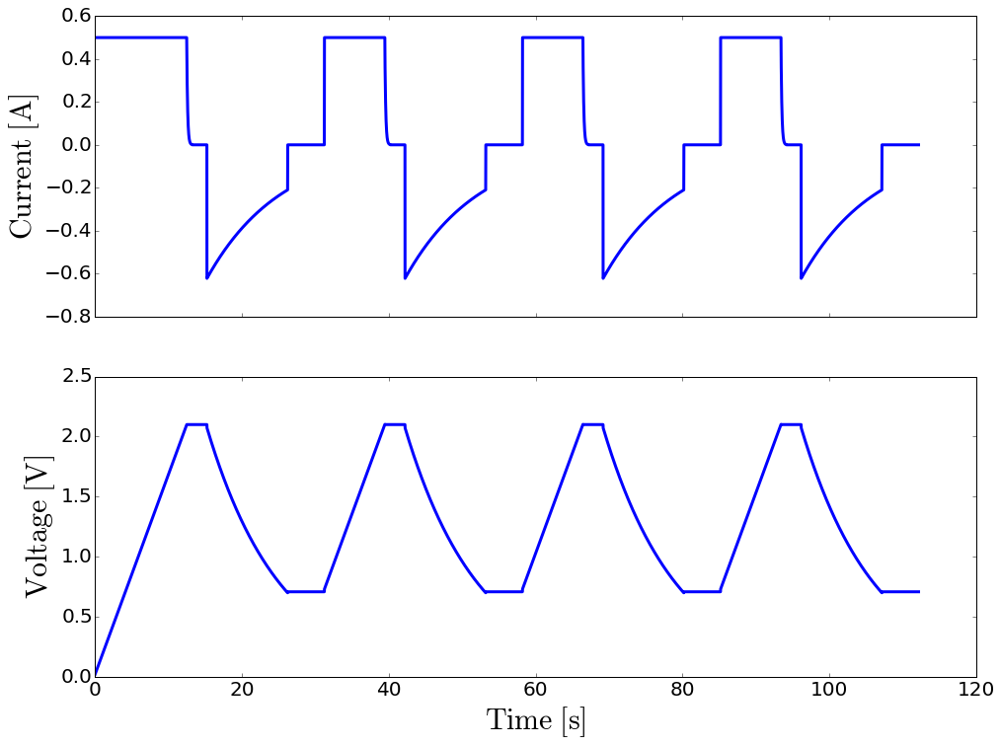

Cyclic Charge-Discharge is a common technique used to test the
performance and cycle-life of energy storage devices. Most often,
the charge and discharge are conducted at constant current until a set
voltage is reached.

The following implements 4 cycles of a repetitive loop through several
steps:

1. constant current charge at :math:`0.5\ \mathrm{A}` until voltage
   reaches a :math:`2.1\ \mathrm{V}` limit
2. potentiostatic hold until the current falls below
   :math:`1\ \mathrm{mA}` for a maximum duration time of
   :math:`3\ \mathrm{min}`
3. rest at open circuit potential for :math:`2\ \mathrm{s}`
4. constant load discharge at :math:`3.33\ \mathrm{\Omega}` to
   :math:`0.7 \mathrm{V}`
5. rest at open circuit potential for :math:`5\ \mathrm{s}`

.. code:: python

    from pycap import PropertyTree,CyclicChargeDischarge,EnergyStorageDevice

    # setup the experiment
    ptree=PropertyTree()
    ptree.put_string('start_with','charge')
    ptree.put_int   ('cycles',4)
    ptree.put_double('time_step',0.01)
    
    ptree.put_string('charge_mode','constant_current')
    ptree.put_double('charge_current',0.5)
    ptree.put_string('charge_stop_at_1','voltage_greater_than')
    ptree.put_double('charge_voltage_limit',2.1)
    ptree.put_bool  ('charge_voltage_finish',True)
    ptree.put_double('charge_voltage_finish_max_time',180)
    ptree.put_double('charge_voltage_finish_current_limit',1e-3)
    ptree.put_double('charge_rest_time',2)
    
    ptree.put_string('discharge_mode','constant_load')
    ptree.put_double('discharge_load',3.33)
    ptree.put_string('discharge_stop_at_1','voltage_less_than')
    ptree.put_double('discharge_voltage_limit',0.7)
    ptree.put_double('discharge_rest_time',5)
    
    ccd=CyclicChargeDischarge(ptree)

The property tree is populated interactively here but it can parse
directly an input file. Please refer to other examples.

The CCD experiment can be started with a ``charge`` or a ``discharge`` 
step. The length of the test is defined by the cycle number and the loop 
end criteria.

The charge mode can be ``constant_current``, ``constant_voltage``, or
``constant_power``. Two end criteria can be selected although only one
is required. **Note that they are no safeguards and poor end criteria
will produce infinite loops!**
If ``voltage_finish`` is enabled (default value is ``False``), the charge step 
proceeds to a potentiostatic step that ends after reaching the specified time
``voltage_finish_max_time`` or when the current falls between the limiting value
``voltage_finish_current_limit`` (absolute value).
The voltage finish step makes little sense in case of a constant voltage charge
and therefore is not allowed.
The charge ends with an optional rest time period before proceeding with the
next step.

The discharge process can be perfomed in four different modes:
``contant_current``, ``contant_voltage``, ``constant_power``, or 
``constant_load``. End criteria must be chosen carfully here as well.

Let's build an energy storage device, here a simple series RC circuit,
with a :math:`40\ \mathrm{m\Omega}` resistor and a :math:`3\ \mathrm{F}`
capacitor, and run the experiment.

.. code:: python

    # build an energy storage device
    ptree=PropertyTree()
    ptree.put_string('type','SeriesRC')
    ptree.put_double('series_resistance',40e-3)
    ptree.put_double('capacitance',3)
    device=EnergyStorageDevice(ptree)

    from pycap import initialize_data,plot_data

    # run the experiment and visualize the measured data
    data=initialize_data()
    steps=ccd.run(device,data)

    print "%d steps"%steps

    %matplotlib inline
    plot_data(data)

11213 time steps (:math:`\Delta t = 0.01\ \mathrm{s}`) are required to complete
the CCD experiment. Below are plotted the measured current and voltage data
versus time.

