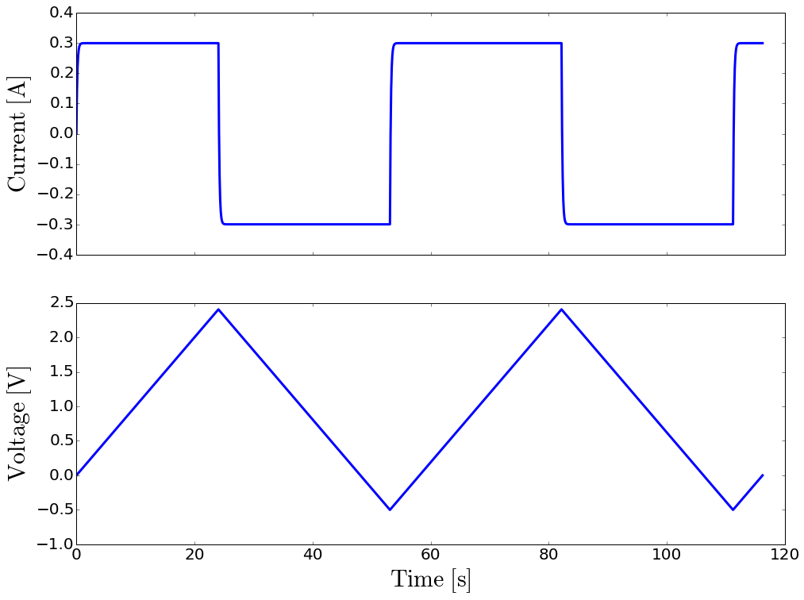
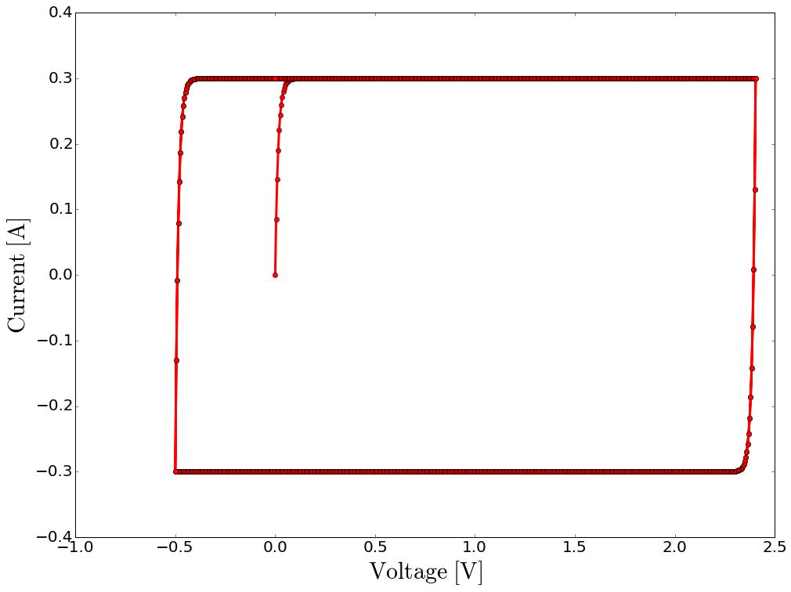

Cyclic voltammetry is a widely-used electrochemical technique to
investigate energy storage devices. It consists in measuring the current
while varying linearly the voltage back and forth over a given range.

The voltage sweep applied to the device creates a current given by

.. raw:: latex

   \begin{equation}
   I = C \frac{dU}{dt}
   \end{equation}

where :math:`I` is the current in ampere and :math:`\frac{dU}{dt}` is
the scan rate of the voltage ramp.

The voltage scan rates for testing energy storage devices are usually
between :math:`0.1\ \mathrm{mV/s}` and :math:`\mathrm{1\ V/s}`. Scan
rates at the lower end of this range allow slow processes to occur; fast
scans often show lower capacitance than slower scans and may produce
large currents on high-value capacitors.

Four parameters define the CV sweep range: The scan starts at
``initial_voltage``, ramps to ``scan_limit_1``, reverses and goes to
``scan_limit_2``. Additional cycles start and end at ``scan_limit_2``.
The scan ends at ``final_voltage``. The rate of voltage change over time
:math:`\frac{dU}{dt}` is specified using ``scan_rate`` which is here set
to :math:`100\ \mathrm{mV/s}`. The sweep range is
[:math:`2.4\ \mathrm{V}`, :math:`-0.5\ \mathrm{V}`]. The scan both
starts and finishes at :math:`0\ \mathrm{V}`. The linear ramp is imposed
in increments of :math:`5\ \mathrm{mV}`.

.. code-block:: python

    from pycap import PropertyTree,EnergyStorageDevice,CyclicVoltammetry
    
    # setup the experiment
    ptree=PropertyTree()
    ptree.put_double('initial_voltage',0)
    ptree.put_double('final_voltage',0)
    ptree.put_double('scan_limit_1',2.4)
    ptree.put_double('scan_limit_2',-0.5)
    ptree.put_double('scan_rate',100e-3)
    ptree.put_double('step_size',5e-3)
    ptree.put_int   ('cycles',2)
    
    cv=CyclicVoltammetry(ptree)

Four parameters define the CV sweep range: The scan starts at
``initial_voltage``, ramps to ``scan_limit_1``, reverses and goes to
``scan_limit_2``. Additional cycles start and end at ``scan_limit_2``.
The scan ends at ``final_voltage``. Here, the sweep range is
[:math:`2.4\ \mathrm{V}`, :math:`-0.5\ \mathrm{V}`]. It both starts and
finishes at :math:`0\ \mathrm{V}`.

The rate of voltage change over time :math:`\frac{dU}{dt}` is specified
using ``scan_rate`` which is here set to :math:`100\ \mathrm{mV/s}`. The
linear ramp is imposed in increments of :math:`5\ \mathrm{mV}`. The
number of sweep is controlled by ``cycles``.

Here we run the experiment with a :math:`3\ \mathrm{F}` capacitor in
series with a :math:`50\ \mathrm{m\Omega}` resistor.

.. code-block:: python

    # build an energy storage device
    ptree=PropertyTree()
    ptree.put_string('type','SeriesRC')
    ptree.put_double('capacitance',3)
    ptree.put_double('series_resistance',50e-3)
    device=EnergyStorageDevice(ptree)
    
    from pycap import initialize_data,report_data,plot_data
    from pycap import plot_cyclic_voltammogram
    
    # run the experiment and visualize the measured data
    data=initialize_data()
    steps=cv.run(device,data)
    
    print "%d steps"%steps
    
    %matplotlib inline
    plot_data(data)
    plot_cyclic_voltammogram(data)

.. parsed-literal::

    2324 steps

On the CV plot (current on the y-axis and voltage on the x-axis), we
read

.. raw:: latex

   \begin{equation}
   I = C \frac{dU}{dt} = 300\ \mathrm{mA}
   \end{equation}

as expected for a :math:`3\ \mathrm{F}` capacitor. For an ideal
capacitor (i.e. no equivalent series resistance), the plot would be a
perfect rectangle. The resistor causes the slow rise in the current at
the scan’s start and rounds two corners of the rectangle. The time
constant :math:`\tau=RC` controls rounding of corners.

