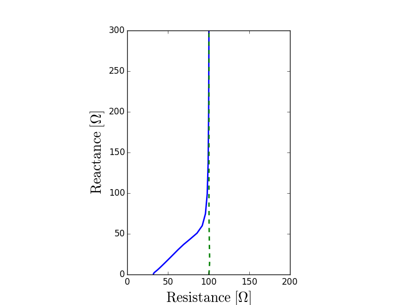

Electrochemical Impedance Spectroscopy (EIS) is a powerful experimental method
for characterizing electrochemical systems.  This technique measures the complex
impedance of the device over a range of frequencies.

A sinusoidal excitation signal (potential or current) is applied:

.. math::

  E = E_0 + \sum_k E_k \sin (\omega_k t + \varphi_k)

That signal consists in the superposition of AC sine waves with amplitude
:math:`E_k`, angular frequency :math:`\omega_k=2\pi kf`, and phase shift
:math:`\phi_k`.  :math:`E_0` is the DC component.

.. code::

    ; `eis.info` file

    frequency_upper_limit  1e+3 ; hertz
    frequency_lower_limit  1e-2 ; hertz
    steps_per_decade          6

    cycles                    2
    ignore_cycles             1
    steps_per_cycle         128

    harmonics                 1
    dc_voltage                0 ; volt
    amplitudes             5e-3 ; volt
    phases                    0 ; degree

In the input data above:

- ``frequency_upper_limit``, ``frequency_lower_limit``, and ``steps_per_decade``
  define the frequency range and the resolution on a log scale (for the
  fundamental frequency).  Frequencies are scanned from the upper limit to the
  lower one.
- Electric current and potential signals are sampled at regular time interval
  and ``steps_per_cycle`` controls the size of that interval.  ``ignore_cycles``
  allows to truncate the data in the Fourier analysis.
  It is best when ``(cycles - ignore_cycles) * steps_per_cycle`` is a power of
  two (most efficient in the discrete Fourier transform) but this does not have
  to be so.
- ``harmonics`` allows to select what harmonics :math:`k` of the fundamental
  frequency :math:`f` to excite.  ``amplitudes`` and ``phases`` are used to
  specify :math:`E_k` and :math:`\varphi_k`, respectively.  They may be given
  as arrays and must have the same size.  This multi-sine feature is
  **experimental** though.  In principle, exciting simultaneously multiple
  frequencies reduces the computational cost associated with a full spectrum
  acquisition, but in practice, it is hard to maintain the quality of the data
  measurement without increasing the number of steps.

Below is an example of EIS measurement using Cap:

.. code-block:: python

    from pycap import PropertyTree, ElectrochemicalImpedanceSpectroscopy,\
                      NyquistPlot

    # setup the experiment
    ptree = PropertyTree()
    ptree.parse.info('eis.info')
    eis = ElectrochemicalImpedanceSpectroscopy(ptree)

    # build an energy storage device and run the EIS measurement
    eis.run(device)

    # visualize the impedance spectrum
    nyquist = NyquistPlot(filename='nyquist.png')
    nyquist.update(eis)

On the Nyquist plot above, the solid blue line shows the impedance of a
supercapacitor on the complex plane with the typical 45 degrees slope for the
higher frequencies.  The vertical dashed green line corresponds to an equivalent
RC circuit.
