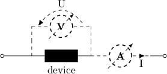

Energy storage devices
======================

Only the electrical current :math:`I` and voltage :math:`U` of the device are
measurable. Several operating conditions are possibles. One may want to
impose:

    - The voltage :math:`U` across the device.
    - The electrical current :math:`I` that flows through it.
    - The load :math:`R=U/I` the device is subject to.
    - The power :math:`P=UI`.

The class :py:class:`pycap.EnergyStorageDevice` is an abstract representation
for an energy storage device. It can evolve in time at various operating
conditions and return the voltage drop across itself and the electrical
current that flows through it.

The rest of this section describes the energy storage devices that are
available in Cap, namely:

    - Equivalent circuits
    - Supercapacitors

.. include:: equivalent_circuits.rst

.. include:: super_capacitor.rst

.. include:: battery.rst
