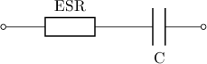
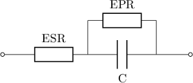

Equivalent circuits
===================

Series RC
---------

A resistor and a capacitor are connected in series (denoted :math:`\mathrm{ESR}` 
and :math:`\mathrm{C}` in the figure above).

.. literalinclude:: series_rc.xml
   :language: xml
   
Above is the database to build a :math:`\mathrm{3\ F}` capacitor in series with a 
:math:`50\ \mathrm{m\Omega}` resistance.

.. math::

     U = U_C + R I

     I = C \frac{dU_C}{dt}

:math:`U_C` stands for the voltage accross the capacitor.
Its capacitance, :math:`C`, represents its ability to store electric charge.
The equivalent series resistance, :math:`R`, add a real component to the
impedance of the circuit:

.. math::

    Z = \frac{1}{jC\omega} + R

As the frequency goes to infinity, the capacitive impedance approaches zero
and :math:`R` becomes significant.

Parallel RC
-----------

   
An extra resistance is placed in parallel of the capacitor. It can be
instantiated by the following database.

.. literalinclude:: parallel_rc.xml
   :language: xml

``type`` has been changed from ``SeriesRC`` to ``ParallelRC``.
A :math:`2.5\ \mathrm{M\Omega}` leakage resistance is specified.

.. math::

     U = U_C + R I

     I = C \frac{dU_C}{dt} + \frac{U_C}{R_L}

:math:`R_L` corresponds to the "leakage" resistance in parallel with the
capacitor. Low values of :math:`R_L` imply high leakage currents which means
the capacitor is not able to hold is charge.
The circuit complex impedance is given by:

.. math::

    Z = \frac{R_L}{jR_LC\omega} + R

