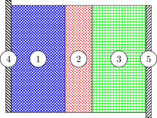

Supercapacitors
---------------

``type`` is set to ``SuperCapacitor``.
``dim`` is used to select two- or three-dimensional simulations.

.. code:: xml

    <device>
        <type>SuperCapacitor</type>
        <dim>2</dim>
        <geometry>
            [...]
        </geometry>
        <material_properties>
            [...]
        </material_properties>
    </device>

Geometry
^^^^^^^^

.. literalinclude:: super_capacitor.xml
    :language: xml
    :start-after: <!-- geometry begin -->
    :end-before: <!-- geometry end -->

``mesh_file`` give the path to the triangulation. The dimension has to match
``dim`` or an exception will be thrown.
The width of each layer in the sandwich (anode collector, anode electrode,
separator, cathode electrode, cathode current collector) can be adjusted
independently from one another. The overall sandwich height and depth (in
3-D) can be changed as well.

    Schematic representation of the supercapacitor conventional sandwich-like
    configuration.
    1: anode electrode,
    2: separator,
    3: cathode electrode,
    4: anode collector,
    5: cathode collector.

Governing equations
^^^^^^^^^^^^^^^^^^^

+------------------------------------+----------------------------------------------------+------------------------------------+
| collector                          | electrode                                          | separator                          |
+====================================+====================================================+====================================+
|                                    |                                                    |                                    |
|:math:`i_1 = -\sigma \nabla \Phi_1` |:math:`i_1 = -\sigma \nabla \Phi_1`                 |:math:`i_2 = -\kappa \nabla \Phi_2` |
|                                    |                                                    |                                    |
|:math:`\nabla \cdot i_1 = 0`        |:math:`i_2 = -\kappa \nabla \Phi_2`                 |:math:`\nabla \cdot i_2 = 0`        |
|                                    |                                                    |                                    |
|                                    |:math:`\nabla \cdot i_1 = \nabla \cdot i_2 = a i_n` |                                    |
|                                    |                                                    |                                    |
+------------------------------------+----------------------------------------------------+------------------------------------+

+------------------------------------------------------------------------+------------------------------------------------------------------------+
| collector-electrode interface                                          |  electrode-separator interface                                         |
+========================================================================+========================================================================+
|                                                                        |                                                                        |
|:math:`0 = -\kappa \left. \frac{\partial \Phi_2}{\partial n} \right|_e` |:math:`-\kappa \left.\frac{\partial \Phi_2}{\partial n}\right|_e        |
|                                                                        |        = -\kappa \left.\frac{\partial \Phi_2}{\partial n}\right|_s`    |
|                                                                        |                                                                        |
|:math:`-\sigma \left.\frac{\partial \Phi_1}{\partial n}\right|_c        |                                                                        |
|        = -\sigma \left.\frac{\partial \Phi_1}{\partial n}\right|_e`    |:math:`-\sigma \left. \frac{\partial \Phi_1}{\partial n} \right|_e = 0` |
|                                                                        |                                                                        |
+------------------------------------------------------------------------+------------------------------------------------------------------------+

+----------------------------------------------------------------+
| boundary collector tab                                         |
+================================================================+
|:math:`\Phi_1 = U`                                              |
|                                                                |
|or                                                              |
|                                                                |
|:math:`-\sigma \frac{\partial \Phi_1}{\partial n} = I/S`        |
|                                                                |
|or                                                              |
|                                                                |
|:math:`-\sigma \frac{\partial \Phi_1}{\partial n} \Phi_1 = P/S` |
|                                                                |
|or                                                              |
|                                                                |
|:math:`-\sigma \frac{\partial \Phi_1}{\partial n} R S = \Phi_1` |
|                                                                |
+----------------------------------------------------------------+

Ignoring the influence of the electrolyte concentration, the current density
in the matrix and solution phases can be expressed by Ohm’s law as

.. math::

    i_1 = -\sigma \nabla \Phi_1

    i_2 = -\kappa \nabla \Phi_2

:math:`i` and :math:`\Phi` represent current density and potential; subscript
indices :math:`1` and :math:`2` denote respectively the solid and the liquid
phases. :math:`\sigma` and :math:`\kappa` are the matrix and solution phase
conductivities.

The total current density is given by :math:`i = i_1 + i_2`. Conservation of
charge dictates that

.. math::

    -\nabla \cdot i_1 = \nabla \cdot i_2 = a i_n

where :math:`a` is the interfacial area per unit volume and the current
transferred from the matrix phase to the electrolyte :math:`i_n` is the sum of
the double-layer the faradaic currents

.. math::

    i_n = C \frac{\partial}{\partial t} \left(\Phi_1 - \Phi_2\right)
        + i_0 \left( e^{\frac{\alpha_a F}{RT}\eta}
            - e^{-\frac{\alpha_c F}{RT}\eta} \right)

:math:`C` is the double-layer capacitance. :math:`i_0` is the exchange current
density, :math:`\alpha_a` and :math:`\alpha_c` the anodic and cathodic charge
transfer coefficients, respectively. :math:`F`, :math:`R`, and :math:`T` stand
for Faraday’s constant, the universal gas constant and temperature.
:math:`\eta` is the overpotential relative to the equilibrium potential
:math:`U_{eq}`

.. math::

    \eta = \Phi_1 - \Phi_2 - U_{eq}

Material properties
^^^^^^^^^^^^^^^^^^^

.. literalinclude:: super_capacitor.xml
    :language: xml
    :start-after: <!-- material_properties begin -->
    :end-before: <!-- material_properties end -->

The specific surface area per unit volume :math:`a` is estimated using

.. math::

    a = \frac{(1+\zeta)\varepsilon}{r}

where :math:`\zeta` is the pore's geometry factor (:math:`\zeta=2` for
spheres, :math:`1` for cylinders, and :math:`0` for slabs) and :math:`r` is
the pore's characteristic dimension.
[M. W. Verbrugge and B. J. Koch, J. Electrochem. Soc., 150, A374 2003]

The solution electrical conductivity :math:`\kappa` incorporates the effect
of porosity and tortuosity

.. math::

    \kappa = \frac{\kappa_\infty \varepsilon}{\Gamma}

where :math:`\kappa_\infty` is the liquid phase (free solution) conductivity,
:math:`\varepsilon` is the void volume fraction, and :math:`\kappa` is the
tortuosity factor.

The solid phase conductivity is also corrected for porosity (and tortuosity???)

.. math::

    \sigma = \sigma_\infty (1-\varepsilon)

