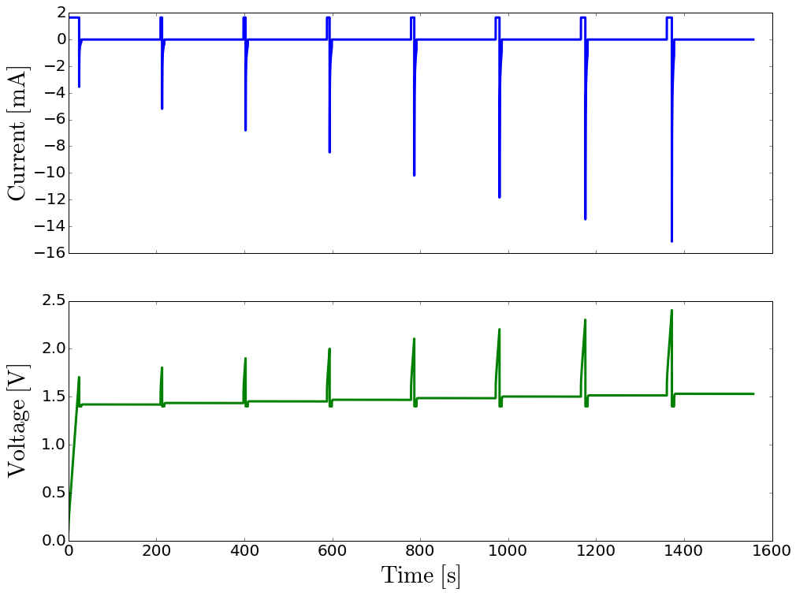
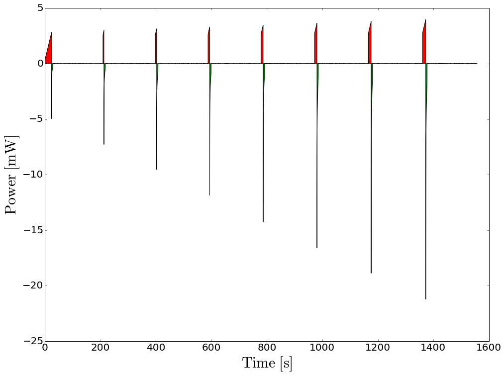

This is based on [Journal of The Electrochemical Society, 152 (5)
D79-D87 (2005)] by M. Verbrugge and P. Liu. It illustrates how easy it
is to specify complex operating conditions for energy storage devices in
``pycap``.

.. code:: python

    from pycap import EnergyStorageDevice,PropertyTree
    from pycap import initialize_data,report_data,plot_data
    from matplotlib import pyplot
    %matplotlib inline

The supercapacitor is initially fully discharged. It is charged to
:math:`1.7\ \mathrm{V}` at a constant current of
:math:`100\ \mathrm{A}`. Subsequently, a constant
:math:`1.4\ \mathrm{V}` is applied for :math:`5\ \mathrm{s}` and the
supercapacitor is allowed to rest at open circuit potential for
:math:`3\ \mathrm{min}`. This sequence is repeated for a series of
charge potentials at :math:`0.1\ \mathrm{V}` increments from :math:`1.8`
to :math:`2.4\ \mathrm{V}`. The routine defined below,
``run_verbrugge_experiment``, implements that experiment and records
measurements for the time, current and voltage.

.. code:: python

    def run_verbrugge_experiment(device):
        charge_current=1.65e-3 # ampere
        discharge_voltage=1.4 # volt
        discharge_time=5.0 # second
        rest_time=180.0 # second
        time_step=0.1 # second
        time=0.0
        data=initialize_data()
        for charge_voltage in [1.7,1.8,1.9,2.0,2.1,2.2,2.3,2.4]:
            # constant current charge
            while device.get_voltage()<charge_voltage:
                time+=time_step
                device.evolve_one_time_step_constant_current(time_step,charge_current)
                report_data(data,time,device)
            # constant voltage discharge
            tick=time
            while time-tick<discharge_time:
                time+=time_step
                device.evolve_one_time_step_constant_voltage(time_step,discharge_voltage)
                report_data(data,time,device)
            # rest at open circuit
            tick=time
            while time-tick<rest_time:
                time+=time_step
                device.evolve_one_time_step_constant_current(time_step,0.0)
                report_data(data,time,device)
        return data

Make an energy storage device (here a supercapacitor) and run the
experiment.

.. code:: python

    input_database=PropertyTree()
    input_database.parse_xml('super_capacitor.xml')
    # no faradaic processes
    input_database.put_double('device.material_properties.electrode_material.exchange_current_density',0.0)
    device=EnergyStorageDevice(input_database.get_child('device'))
    # run experiment
    data=run_verbrugge_experiment(device)

Postprocess the results.

.. code:: python

    time=data['time']
    current=data['current']
    voltage=data['voltage']
    label_fontsize=30
    tick_fontsize=20
    labelx=-0.05
    labely=0.5
    plot_linewidth=3
    f,axarr=pyplot.subplots(2,sharex=True,figsize=(16,12))
    axarr[0].plot(time,1e+3*current,'b-',lw=plot_linewidth)
    axarr[0].set_ylabel(r'$\mathrm{Current\ [mA]}$',fontsize=label_fontsize)
    axarr[0].get_yaxis().set_tick_params(labelsize=tick_fontsize)
    axarr[0].yaxis.set_label_coords(labelx,labely)
    axarr[1].plot(time,voltage,'g-',lw=plot_linewidth)
    axarr[1].set_ylabel(r'$\mathrm{Voltage\ [V]}$',fontsize=label_fontsize)
    axarr[1].set_xlabel(r'$\mathrm{Time\ [s]}$',fontsize=label_fontsize)
    axarr[1].get_yaxis().set_tick_params(labelsize=tick_fontsize)
    axarr[1].get_xaxis().set_tick_params(labelsize=tick_fontsize)
    axarr[1].yaxis.set_label_coords(labelx,labely)
    pyplot.show()

Plot the power versus time. The red surface area represents the energy
used to charge the supercapacitor and the green on the power pulses is
the energy recovered.

.. code:: python

    power=current*voltage
    pyplot.figure(figsize=(16,12))
    pyplot.fill_between(time,1e+3*power,0,where=power>0,facecolor='r')
    pyplot.fill_between(time,1e+3*power,0,where=power<0,facecolor='g')
    pyplot.xlabel(r'$\mathrm{Time\ [s]}$',fontsize=label_fontsize)
    pyplot.ylabel(r'$\mathrm{Power\ [mW]}$',fontsize=label_fontsize)
    pyplot.gca().get_xaxis().set_tick_params(labelsize=tick_fontsize)
    pyplot.gca().get_yaxis().set_tick_params(labelsize=tick_fontsize)
    pyplot.show()

